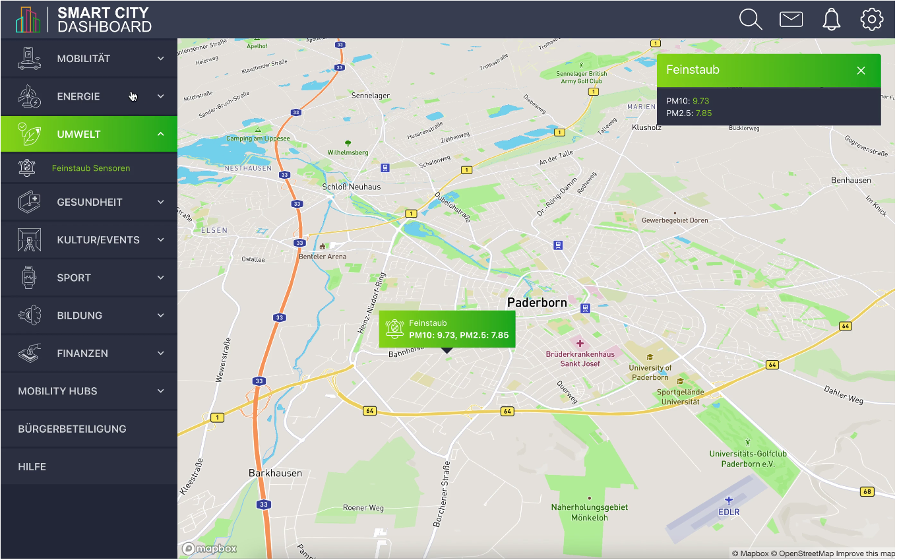

# Smart City Dashboard
A **smart city** is an urban area that uses IoT, sensors and data analytics to manage assets, resources and services efficiently.

The **Smart City Dashboard** website aims to show how the dashboard of a smart city looks and functions, by providing meaningful information provided by a backend and displayed using a well-structured frontend.

## Contents
The side panel contains the main content menu of the page with the following:
 1. Mobility
  - Parking Lot
  - Parking Spaces
  - Charging Stations
  - Accidents
  - Bus Stations
  - Bike Stations

 2. Energy
  - Power Consumption
  - Renewable Energy Production
  - Street Lighting System
  - Carbon Emissions

 3. Environment
  - Air Quality Index
  - Noise Pollution Data
  - Weather Station Data
  - Water Quality
  - Waste Management

 4. Health
  - Hospitals
  - Pharmacies
  - Disease Monitoring
  - Emergency Response
  - Health Alerts

 5. Culture
  - Upcoming Events
  - Museums
  - Public Libraries
  - Tourism Analytics
  - Public Wi-Fi Zones

 6. Sport
  - Facility Locations
  - Gymnasiums
  - Fitness Activity Trends

 7. Education
  - Educational Institutions
  - School Transports
  - Literacy Statistics

 8. Finance
  - Banks & ATMs
  - Budget Allocation
  - Tax Revenue Dashboard
  - Smart Payment Systems
  - Property Market Trends

## API Reference

All endpoints are `GET` requests served from `http://localhost:5000`.

---

### 🚗 Mobility

| Endpoint | Description | Returns |
|---|---|---|
| `GET /mobility/parking-lots` | All parking lot locations across Tokyo | Lot name, capacity, availability, coordinates |
| `GET /mobility/parking-spaces` | Individual parking space status | Space ID, status, zone, coordinates |
| `GET /mobility/charging-stations` | EV charging station locations | Connector types, availability, fee per kWh |
| `GET /mobility/accidents` | Reported road accidents | Location, severity, reported time, status |
| `GET /mobility/bus-stations` | Bus stop locations and routes | Station name, routes served, coordinates |
| `GET /mobility/bike-stations` | Bike sharing station locations | Station name, available bikes, capacity |

---

### ⚡ Energy

| Endpoint | Description | Returns |
|---|---|---|
| `GET /energy/power-consumption` | Power usage by district | District, consumption (kWh), peak hour range |
| `GET /energy/renewable-energy` | Renewable energy production sites | Source type, output (kWh), location |
| `GET /energy/street-lighting` | Street lighting system status | Zone, light count, status, last updated |
| `GET /energy/carbon-emissions` | Carbon emission levels by zone | Zone, emission level, major sources |

---

### 🌿 Environment

| Endpoint | Description | Returns |
|---|---|---|
| `GET /environment/air-quality` | Air quality index readings | AQI value, PM10, PM2.5, station location |
| `GET /environment/noise-pollution` | Noise pollution sensor data | Decibel level, peak time, district |
| `GET /environment/weather-stations` | Weather station readings | Temperature, humidity, wind speed, location |
| `GET /environment/water-quality` | Water quality monitoring data | Quality index, contaminant levels, location |
| `GET /environment/waste-management` | Waste collection site data | Site name, fill level, last collected, location |

---

### 🏥 Health

| Endpoint | Description | Returns |
|---|---|---|
| `GET /health/hospitals` | Hospital locations and details | Name, specialties, capacity, emergency status |
| `GET /health/pharmacies` | Pharmacy locations | Name, opening hours, services, coordinates |
| `GET /health/disease-monitoring` | Disease outbreak monitoring data | Disease type, affected districts, case count |
| `GET /health/emergency-response` | Emergency response unit locations | Unit type, status, response time, coordinates |
| `GET /health/health-alerts` | Active public health alerts | Title, severity, description, affected districts |

---

### 🎭 Culture

| Endpoint | Description | Returns |
|---|---|---|
| `GET /culture/upcoming-events` | Upcoming city events | Event name, venue, dates, ticket price, category |
| `GET /culture/museums` | Museum locations and details | Name, opening hours, entry fee, nearby landmarks |
| `GET /culture/public-libraries` | Public library locations | Name, opening hours, services, coordinates |
| `GET /culture/tourism-analytics` | Tourism data by zone | Visitor count, top nationalities, seasonality index |
| `GET /culture/wifi-zones` | Public Wi-Fi hotspot locations | Zone name, network speed, coverage area |

---

### 🏅 Sport

| Endpoint | Description | Returns |
|---|---|---|
| `GET /sport/facility-locations` | Sports facility locations | Facility name, sports supported, coordinates |
| `GET /sport/gymnasiums` | Gymnasium details across Tokyo | Name, gym type, entry fee, opening hours, crowd level |
| `GET /sport/fitness-activity-trends` | Fitness activity data by zone | Zone, activity type, weekly trend scores, intensity level |

---

### 🎓 Education

| Endpoint | Description | Returns |
|---|---|---|
| `GET /education/educational-institutions` | Schools and universities | Name, type, courses offered, coordinates |
| `GET /education/school-transports` | School transport routes | Route ID, schools served, schedule |
| `GET /education/literacy-statistics` | Literacy rate data by district | District, literacy rate, trend |

---

### 💰 Finance

| Endpoint | Description | Returns |
|---|---|---|
| `GET /finance/banks-atms` | Bank and ATM locations | Name, type, services, opening hours |
| `GET /finance/budget-allocation` | City budget allocation data | Department, allocated amount, spent amount |
| `GET /finance/tax-revenue` | Tax revenue by district | District, revenue amount, collection period |
| `GET /finance/smart-payment-systems` | Smart payment terminal locations | Terminal ID, supported methods, location |
| `GET /finance/property-market-trends` | Property market data by zone | Zone, avg price per sqm, trend, property type |

## Sources
The primary inspiration for this project is taken from the EDAG group in Germany that provides a smart city dashboard reference of what to expect and how a dashboard for a smart city is supposed to look like.

<a href="https://smartcity.edag.com/en/referenzen/smart-city-dashboard" target="_blank">Link to EDAG smart city dashboard reference</a>

### Image Sources
Most of the images for the icons have been taken from <a href="flaticon.com">Flaticon.com</a>
#### Icon attributions:
* <a href="https://www.flaticon.com/free-icons/mobility" title="mobility icons">Mobility icons created by Iconjam - Flaticon</a>
* <a href="https://www.flaticon.com/free-icons/energy" title="energy icons">Energy icons created by Pixel perfect - Flaticon</a>
* <a href="https://www.flaticon.com/free-icons/eco-friendly" title="eco friendly icons">Eco friendly icons created by kmg design - Flaticon</a>
* <a href="https://www.flaticon.com/free-icons/healthcare" title="healthcare icons">Healthcare icons created by Kalashnyk - Flaticon</a>
* <a href="https://www.flaticon.com/free-icons/culture" title="culture icons">Culture icons created by Freepik - Flaticon</a>
* <a href="https://www.flaticon.com/free-icons/sports" title="sports icons">Sports icons created by Icongeek26 - Flaticon</a>
* <a href="https://www.flaticon.com/free-icons/book" title="book icons">Book icons created by Good Ware - Flaticon</a>
* <a href="https://www.flaticon.com/free-icons/money" title="money icons">Money icons created by Freepik - Flaticon</a>
* <a href="https://www.flaticon.com/free-icons/smart-city" title="smart city icons">Smart city icons created by Freepik - Flaticon</a>
* <a href="https://www.flaticon.com/free-icons/bicycle-parking" title="bicycle parking icons">Bicycle parking icons created by Roman Káčerek - Flaticon</a>
* <a href="https://www.flaticon.com/free-icons/parking-lot" title="parking lot icons">Parking lot icons created by cube29 - Flaticon</a>
* <a href="https://www.flaticon.com/free-icons/car" title="car icons">Car icons created by monkik - Flaticon</a>
* <a href="https://www.flaticon.com/free-icons/traffic" title="traffic icons">Traffic icons created by Smashicons - Flaticon</a>
* <a href="https://www.flaticon.com/free-icons/crash" title="crash icons">Crash icons created by Freepik - Flaticon</a>
* <a href="https://www.flaticon.com/free-icons/transportation" title="transportation icons">Transportation icons created by meaicon - Flaticon</a>
* <a href="https://www.flaticon.com/free-icons/bike-parking" title="bike parking icons">Bike parking icons created by Freepik - Flaticon</a>
* <a href="https://www.flaticon.com/free-icons/consumption" title="Consumption icons">Consumption icons created by SANB - Flaticon</a>
* <a href="https://www.flaticon.com/free-icons/renewable-energy" title="renewable energy icons">Renewable energy icons created by Freepik - Flaticon</a>
* <a href="https://www.flaticon.com/free-icons/lighting" title="lighting icons">Lighting icons created by Eucalyp - Flaticon</a>
* <a href="https://www.flaticon.com/free-icons/co2-cloud" title="CO2 cloud icons">CO2 cloud icons created by Freepik - Flaticon</a>
* <a href="https://www.flaticon.com/free-icons/air" title="air icons">Air icons created by Phoenix Group - Flaticon</a>
* <a href="https://www.flaticon.com/free-icons/noisy" title="noisy icons">Noisy icons created by Freepik - Flaticon</a>
* <a href="https://www.flaticon.com/free-icons/climatology" title="climatology icons">Climatology icons created by Edi Prast - Flaticon</a>
* <a href="https://www.flaticon.com/free-icons/clean" title="clean icons">Clean icons created by Freepik - Flaticon</a>
* <a href="https://www.flaticon.com/free-icons/waste" title="waste icons">Waste icons created by Freepik - Flaticon</a>
* <a href="https://www.flaticon.com/free-icons/hospital" title="hospital icons">Hospital icons created by joalfa - Flaticon</a>
* <a href="https://www.flaticon.com/free-icons/drug" title="drug icons">Drug icons created by Freepik - Flaticon</a>
* <a href="https://www.flaticon.com/free-icons/disease" title="disease icons">Disease icons created by Tempo_doloe - Flaticon</a>
* <a href="https://www.flaticon.com/free-icons/ambulance" title="ambulance icons">Ambulance icons created by Freepik - Flaticon</a>
* <a href="https://www.flaticon.com/free-icons/health" title="health icons">Health icons created by juicy_fish - Flaticon</a>
* <a href="https://www.flaticon.com/free-icons/calendar" title="calendar icons">Calendar icons created by srip - Flaticon</a>
* <a href="https://www.flaticon.com/free-icons/museum" title="museum icons">Museum icons created by Good Ware - Flaticon</a>
* <a href="https://www.flaticon.com/free-icons/book" title="book icons">Book icons created by mavadee - Flaticon</a>
* <a href="https://www.flaticon.com/free-icons/tourism" title="tourism icons">Tourism icons created by GOWI - Flaticon</a>
* <a href="https://www.flaticon.com/free-icons/wifi" title="wifi icons">Wifi icons created by Freepik - Flaticon</a>
* <a href="https://www.flaticon.com/free-icons/facility" title="facility icons">Facility icons created by Iconjam - Flaticon</a>
* <a href="https://www.flaticon.com/free-icons/gym" title="gym icons">Gym icons created by Freepik - Flaticon</a>
* <a href="https://www.flaticon.com/free-icons/gym" title="gym icons">Gym icons created by Freepik - Flaticon</a>
* <a href="https://www.flaticon.com/free-icons/school" title="school icons">School icons created by Freepik - Flaticon</a>
* <a href="https://www.flaticon.com/free-icons/school-bus" title="school-bus icons">School-bus icons created by Freepik - Flaticon</a>
* <a href="https://www.flaticon.com/free-icons/literacy" title="literacy icons">Literacy icons created by berkahicon - Flaticon</a>
* <a href="https://www.flaticon.com/free-icons/bank" title="bank icons">Bank icons created by Freepik - Flaticon</a>
* <a href="https://www.flaticon.com/free-icons/budget" title="budget icons">Budget icons created by Freepik - Flaticon</a>
* <a href="https://www.flaticon.com/free-icons/tax" title="tax icons">Tax icons created by kornkun - Flaticon</a>
* <a href="https://www.flaticon.com/free-icons/transaction" title="transaction icons">Transaction icons created by Ilham Fitrotul Hayat - Flaticon</a>
* <a href="https://www.flaticon.com/free-icons/real-estate" title="real estate icons">Real estate icons created by Freepik - Flaticon</a>

### Map Source:

Map tile layer has been taken from Carto DB.
 <a href="https://carto.com/">Carto DB</a>